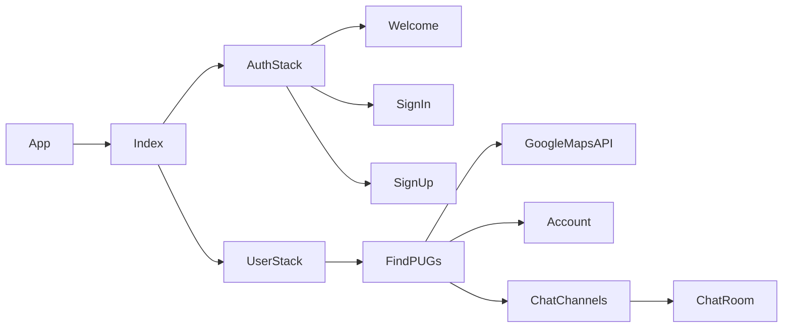

# Got Next

**Summary**
| Field | Detail |
|-------|--------|
| Project Name | Got Next |
| Description | An app created in React Native for finding local pick-up games (POGs) and connecting with other players. |
| Developers | [Cheryl](https://github.com/chess2022) |
| Live Website | none yet |

## User Stories

List of stories users should experience when using your application.

- As a user, I can enter a location and find nearby basketball courts.
- As a user, I can get directions to a nearby court.
- As a user, I can signup/login to access content.
- As a user, I can join local message boards.
- As a user, I can post on message boards to organize a game or chat.
- As a user, I can update or delete my postings on the message boards.
- As a user, I can logout.
- As a user, I can delete my account.

## List of technologies used

- Expo React Native
- Javascript
- Firebase
- Google Maps

## ERD

## Component Architecture

## User Interface Mockups

#### Main Page

