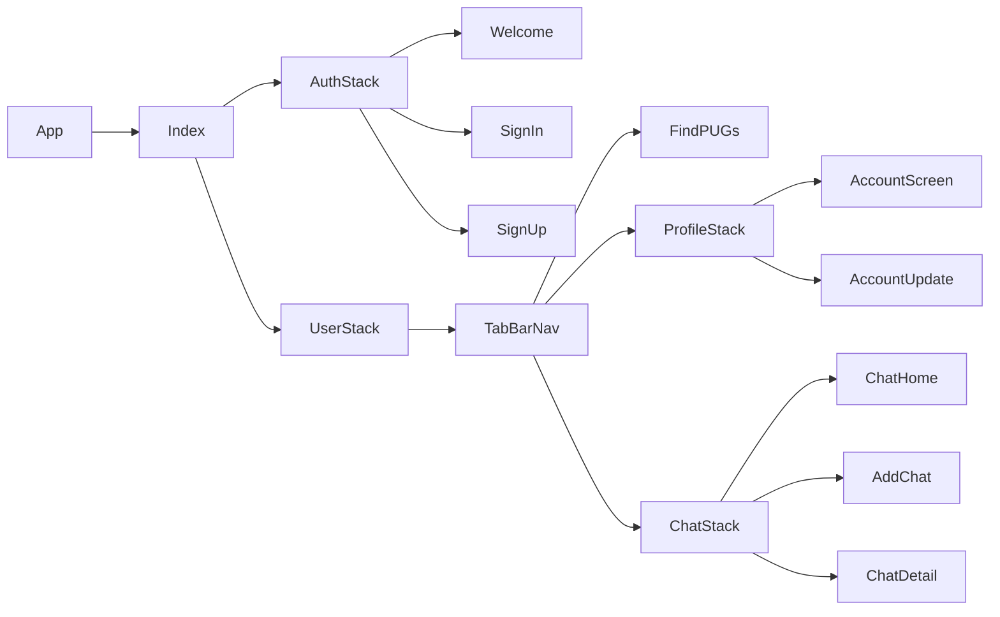

# Got Next

#### When my oldest moved to Seattle, he didn't know where to go to play a pick-up game. He asked, "Wouldn't it be great if there was an app for this?" During my time enrolled in a coding bootcamp at GA, I knew one of my projects would be solving his dilemma. This app was created as a simple solution to his idea. 
#### Currently working on iOS only

**Summary**
| Field | Detail |
|-------|--------|
| Project Name | Got Next |
| Description | An app created in React Native for finding local pick-up games (PUGs) and connecting with other players. |
| Developers | [Cheryl](https://github.com/chess2022) |
| Live | [Expo Go](exp://exp.host/@caweigel007/GotNext?release-channel=default) |
| Contact | [Email Me](mailto:cheryl.weigel@gmail.com) for test access to the app |

## User Stories

List of stories users should experience when using your application.

- As a user, I can signup/login to access content.
- As a user, my location is detected so nearby courts are displayed right away.
- As a user, I can click on any pinned spot on the map and find the court address.
- As a user, I can enter a location and find basketball courts in other locations.
- As a user, I can chat with friends through the app to organize a game.
- As a user, I can have multiple chat topics to chat with different groups.
- As a user, I can logout.
- As a user, I can update my account name and photo.

## List of technologies used

- Expo React Native
- Javascript
- Firebase Auth
- Firestore
- Google Maps APIs

## ERD

## Component Architecture

## Screenshots

#### Initial Page

### Signin/Signup

### Account

### Map

### Chat

## Future Releases

- Add timeout to wait for user to finish typing before search begins
- Image upload from camera roll for profile pic
- Image upload for chats
- Animated scrolling with map location details
- Private chats 
- List of public chats to join
- Android compatibility
- Web version

